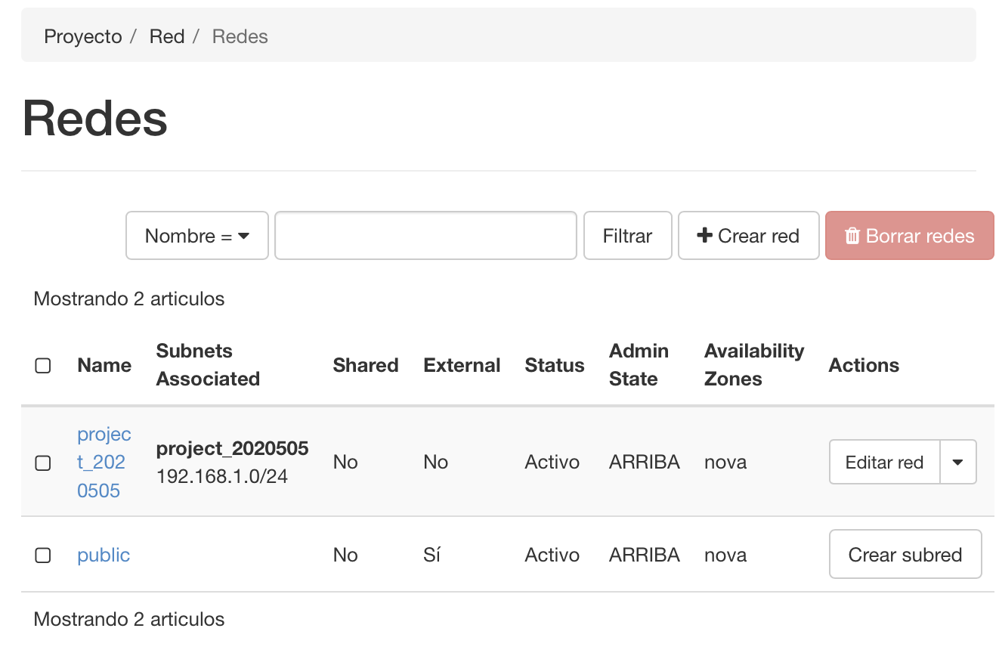
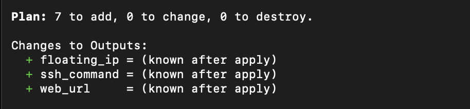
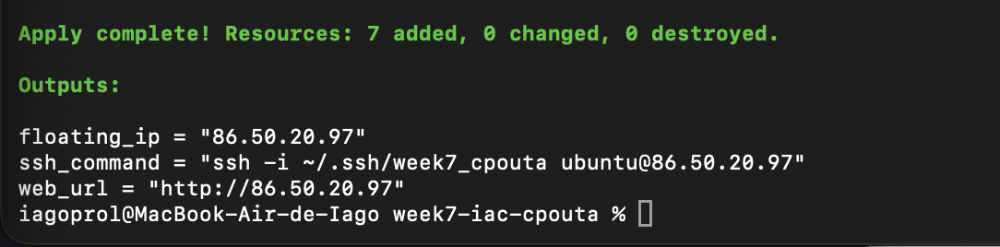
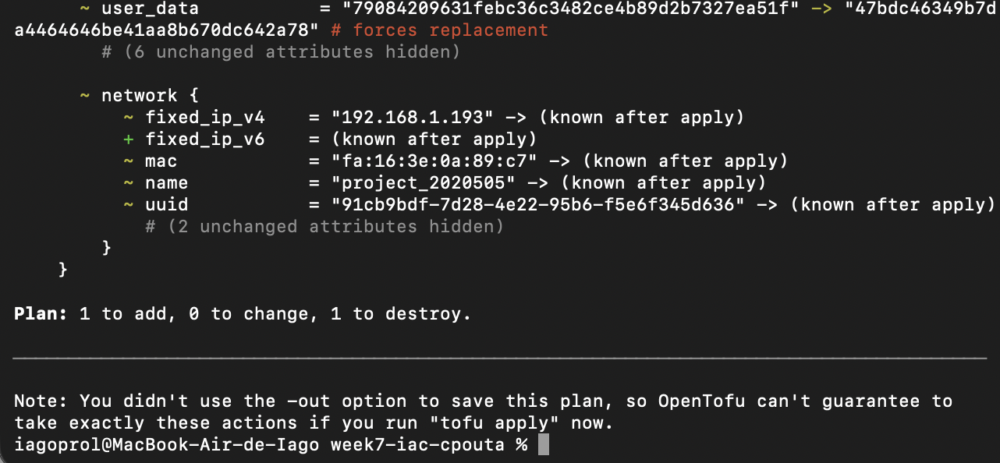
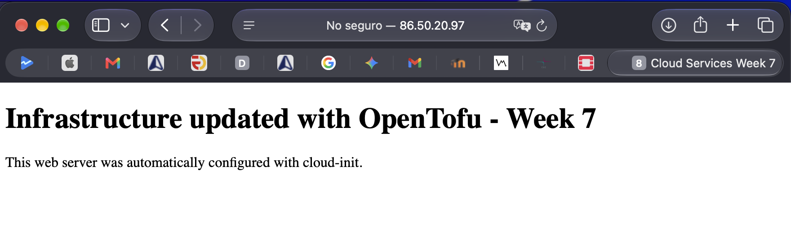
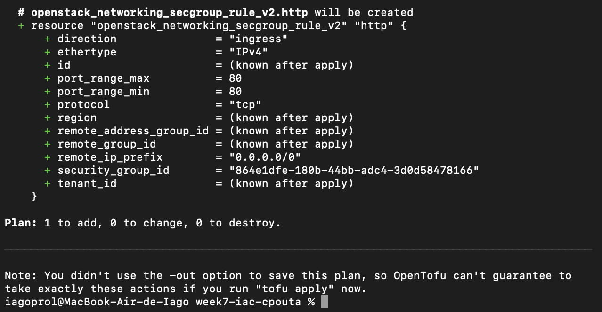
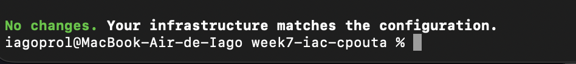
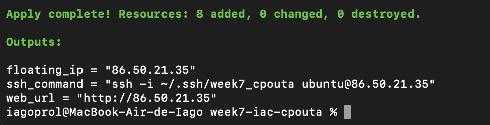
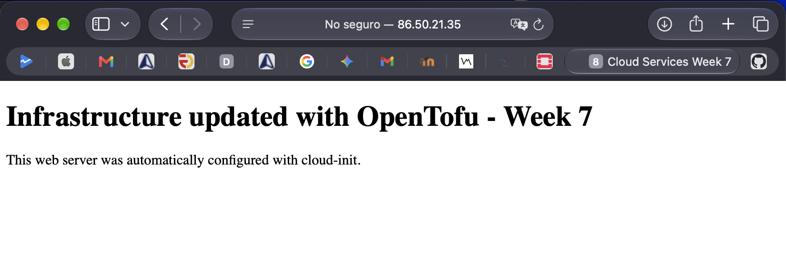

# Cloud Services – Week 7: Infrastructure as Code

## Overview

In this assignment I used OpenTofu to create and manage infrastructure in CSC cPouta using the OpenStack provider.

The infrastructure includes a virtual machine, networking configuration, security rules, an SSH key pair and a floating IP. The VM is automatically configured with cloud-init to install Apache and create a simple web page.

## Infrastructure

The OpenTofu configuration creates:

- Ubuntu 24.04 virtual machine using the `standard.tiny` flavor
- OpenStack security group
- SSH rule restricted to my public IP
- HTTP rule allowing access to port 80
- Neutron network port
- SSH key pair
- Floating IP
- Floating IP association

The existing cPouta project network and Ubuntu image are retrieved using OpenStack data sources.

## Automatic configuration with cloud-init

The VM uses cloud-init during its first boot.

Cloud-init automatically:

1. Updates the package information.
2. Installs Apache.
3. Creates `/var/www/html/index.html`.
4. Enables and starts the Apache service.

This means that no manual configuration of the web server is required after creating the VM.

## OpenTofu workflow

The infrastructure can be created using:

    tofu init
    tofu validate
    tofu plan
    tofu apply

After applying the configuration, OpenTofu outputs the floating IP, SSH command and web URL.

Local credentials, state files and personal configuration are excluded from Git using `.gitignore`.

## Experiment 1 – Declarative infrastructure change

I changed the `page_message` variable used by the cloud-init configuration.

After running `tofu plan`, OpenTofu detected that the VM `user_data` had changed. Because this requires replacing the instance, the plan showed that the VM would be destroyed and recreated.

After applying the change and waiting for cloud-init to finish, the new VM displayed the updated message:

`Infrastructure updated with OpenTofu - Week 7`

This demonstrates how changes in the declared configuration are detected and applied by OpenTofu.

## Experiment 2 – Configuration drift

To test configuration drift, I manually deleted the HTTP ingress rule from the security group using the OpenStack Horizon interface.

When I ran `tofu plan`, OpenTofu detected that the HTTP rule defined in the configuration was missing and proposed creating it again.

After running `tofu apply`, the rule was restored. A final `tofu plan` returned:

`No changes. Your infrastructure matches the configuration.`

This demonstrates how Infrastructure as Code can detect and correct manual changes made outside OpenTofu.

## Experiment 3 – Destroy and rebuild

I destroyed all infrastructure managed by the configuration using:

    tofu destroy

OpenTofu successfully removed all 8 managed resources.

I then ran `tofu apply` again without manually creating or configuring any resources in OpenStack.

OpenTofu recreated all 8 resources, assigned a new floating IP and cloud-init automatically installed and configured Apache again. The web page was accessible after the deployment.

This demonstrates that the complete infrastructure is reproducible from the IaC configuration.

## Problem encountered

Initially, the floating IP resource appeared correctly in the OpenTofu state, but it was not actually associated with the VM in OpenStack.

The first implementation obtained the port indirectly from the compute instance. I solved the problem by explicitly managing a Neutron port with `openstack_networking_port_v2`.

The same managed port is now used both by the VM and by the floating IP association. After this change, the floating IP was automatically associated correctly when running `tofu apply`.

## Security

Sensitive and local files are excluded from the Git repository, including:

- `clouds.yaml`
- OpenTofu state files
- `terraform.tfvars`
- private SSH keys

SSH access is also restricted to a specific public IP address instead of being open to the entire Internet.

## Files

- `main.tf` – OpenStack infrastructure resources
- `variables.tf` – input variables
- `outputs.tf` – useful deployment outputs
- `versions.tf` – OpenTofu and provider requirements
- `cloud-init.yaml` – automatic VM configuration
- `.terraform.lock.hcl` – provider dependency lock file
- `.gitignore` – excludes credentials, state and local configuration

## Evidence

### Initial infrastructure deployment

The following screenshots show the cPouta network used by the deployment and the initial OpenTofu plan and apply.

### Experiment 1 – Declarative change

OpenTofu detected the configuration change and planned the required infrastructure update.

After applying the change, the updated page was served by the VM.

### Experiment 2 – Configuration drift

After manually deleting the HTTP security rule, OpenTofu detected the missing resource.

After restoring the desired state, another plan confirmed that the infrastructure matched the configuration.

### Experiment 3 – Destroy and rebuild

OpenTofu successfully destroyed all managed resources.

The same configuration was then used to recreate all 8 resources from scratch.

Finally, the automatically configured Apache web server was accessible again after the rebuild.

