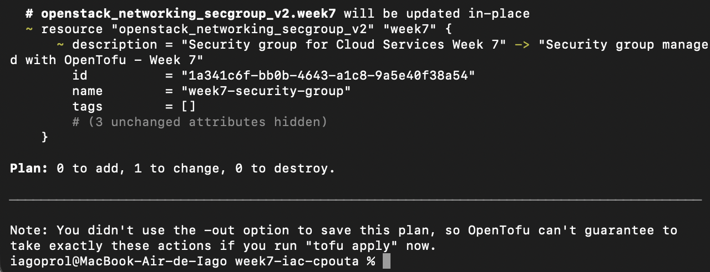

# Cloud Services – Week 7: Infrastructure as Code

## Part A – Questions

### 1. What is Infrastructure as Code, and which problems of manually created infrastructure does it solve?

Infrastructure as Code means creating and managing infrastructure using code instead of doing everything manually from a web interface. For example, in Week 1 I had to create the VM, configure the security rules and install the web server manually. The problem is that if I delete that VM, I would have to remember all the steps and do them again.

With OpenTofu, the configuration is saved in files, so I can create the same infrastructure again using `tofu apply`. This also makes it easier to know exactly how the infrastructure was configured and to keep the configuration in Git.


### 2. Explain the difference between declarative and imperative infrastructure automation. What does idempotency mean, and why is it important?

In an imperative approach we specify the steps that have to be executed, for example create a VM, create a security group and then attach it to the VM. In a declarative approach we describe what we want the final infrastructure to look like and the tool decides what changes are necessary.

OpenTofu is declarative. When I run `tofu plan`, it compares my configuration with the current infrastructure. If everything is already correct, it does not create the resources again. This is idempotency, and it is useful because we can run the same configuration multiple times without creating duplicate resources.


### 3. What is the state file used for? Why should it not be committed to a Git repository, and how do teams usually share it instead?

The state file is used by OpenTofu to keep track of the real cloud resources that correspond to the resources in the code. For example, it stores information about the VM, security group and floating IP that OpenTofu created.

It should not be uploaded to Git because it can contain sensitive information and details about the infrastructure. In this project I added the state files to `.gitignore`. In a team, the state can be stored in a remote backend instead of keeping separate copies on each person's computer.


### 4. What is configuration drift, how does it happen, and how does an IaC tool detect it?

Configuration drift happens when the real infrastructure becomes different from what is defined in the code. This can happen when someone changes something manually using the cloud web interface instead of changing the OpenTofu files.

I tested this during the assignment by manually deleting the HTTP rule from my security group in Horizon. When I ran `tofu plan`, OpenTofu compared the real infrastructure with its configuration and detected that the rule was missing. It proposed creating the HTTP rule again, and after `tofu apply` another plan showed that there were no more changes.


## Part B – Rebuild the VM as Code

## Overview

In this assignment I used OpenTofu to create and manage infrastructure in CSC cPouta using the OpenStack provider.

The infrastructure includes a virtual machine, networking configuration, security rules, an SSH key pair and a floating IP. The VM is automatically configured with cloud-init to install Apache and create a simple web page.

The objective was to be able to destroy the infrastructure and create it again without manually creating resources in Horizon or configuring the web server over SSH.


## Infrastructure

The OpenTofu configuration creates:

- An Ubuntu 24.04 virtual machine using the `standard.tiny` flavor.
- An OpenStack security group.
- An SSH rule restricted to my public IP.
- An HTTP rule allowing access to port 80 from the Internet.
- A Neutron network port.
- An SSH key pair created from my public key.
- A floating public IP.
- An association between the floating IP and the VM network port.

The project network and Ubuntu image already exist in cPouta, so they are retrieved using OpenStack data sources instead of being created by OpenTofu.


### Resources and dependencies

The resources in `main.tf` are connected using references instead of manually writing resource IDs.

The key pair uploads only my public SSH key to OpenStack. The security group defines the firewall used by the server, and the two security group rules allow HTTP traffic and restrict SSH traffic to my IP.

The network port is created inside the existing project network and uses the security group. The virtual machine then uses this port and the SSH key pair.

The floating IP is allocated from the public network and associated with the same network port. This gives the VM access from outside the private cPouta network.

Because the resources refer to each other, OpenTofu can determine the order in which they have to be created and destroyed.


## Files

- `main.tf` – defines the OpenStack resources and their relationships.
- `variables.tf` – declares the input variables used by the configuration and includes validation for the SSH CIDR.
- `outputs.tf` – prints useful information such as the floating IP, SSH command and web URL.
- `versions.tf` – defines the required OpenTofu version and OpenStack provider.
- `cloud-init.yaml` – installs and configures the Apache web server automatically.
- `.terraform.lock.hcl` – records the provider version selected by OpenTofu.
- `.gitignore` – prevents local files, credentials and state files from being committed.


## Automatic configuration with cloud-init

The VM uses cloud-init during its first boot.

Cloud-init automatically:

1. Updates the package information.
2. Installs Apache.
3. Creates `/var/www/html/index.html`.
4. Enables and starts the Apache service.

This means that I do not need to connect with SSH and manually install Apache after creating the VM.


## OpenTofu workflow

The main commands I used were:

```bash
tofu init
tofu fmt
tofu validate
tofu plan
tofu apply
```

After applying the configuration, OpenTofu outputs the floating IP, SSH command and web URL.

Local credentials, state files and personal configuration are excluded from Git using `.gitignore`.


## Experiment 1 – Change

### Change 1: Web page message

**Prediction:** I thought that changing the `page_message` would update the content of the web page. I was not sure if OpenTofu would update the existing VM or create a new one.

**Result:** After changing `page_message` and running `tofu plan`, OpenTofu showed that the `user_data` of the VM had changed and that the VM had to be replaced. The plan showed one resource to add and one to destroy.

After applying the change and waiting for cloud-init to finish, the new VM displayed:

`Infrastructure updated with OpenTofu - Week 7`

**Explanation:** The message is part of the cloud-init configuration passed to the VM as `user_data`. This configuration is used when the VM is created, so changing it caused OpenTofu to replace the VM instead of modifying the running VM.

### Change 2: Security group description

**Prediction:** I thought that changing only the description of the security group would be an in-place update because the security group itself did not need to be recreated.

**Result:** The prediction was correct. `tofu plan` showed:

`Plan: 0 to add, 1 to change, 0 to destroy.`

The security group was marked as `update in-place`. After `tofu apply`, the change was completed without replacing the VM.

**Explanation:** Unlike the VM `user_data`, the description of an existing security group can be modified directly by OpenStack. This showed me that changing the OpenTofu code does not always mean that a resource has to be recreated.


## Experiment 2 – Configuration drift

**Prediction:** I manually deleted the HTTP ingress rule from the security group in Horizon. I expected OpenTofu to detect that the real infrastructure was different from the code and propose creating the HTTP rule again.

**Result:** When I ran `tofu plan`, OpenTofu detected that the HTTP rule defined in the configuration was missing. The plan showed:

`Plan: 1 to add, 0 to change, 0 to destroy.`

After running `tofu apply`, OpenTofu recreated the missing rule. I ran `tofu plan` again and received:

`No changes. Your infrastructure matches the configuration.`

**Explanation:** OpenTofu knew that the HTTP rule should exist because it was still defined in the code and tracked as part of the infrastructure. When I deleted it manually, the real infrastructure no longer matched the desired state. OpenTofu detected this difference and restored the missing resource.

This also showed why manually changing resources managed by IaC can be a problem, because the code should normally be the source of truth.


## Experiment 3 – Destroy and rebuild

**Prediction:** I expected `tofu destroy` to remove all the resources managed by this configuration. After that, I expected `tofu apply` to recreate the complete infrastructure and configure Apache again without me creating anything manually.

**Result:** `tofu destroy` successfully removed all 8 managed resources. The resources were removed according to their dependencies, so resources that depended on others had to be removed before their dependencies could disappear.

After the destroy finished, I ran `tofu apply` again. OpenTofu created all 8 resources again and assigned a new floating IP to the server.

After waiting for cloud-init to finish, the Apache web page was accessible again without manually installing or configuring the web server.

**Explanation:** This experiment showed the main advantage of having the infrastructure defined as code. Even after completely deleting the infrastructure, I could reproduce it using the same configuration. OpenTofu handled the infrastructure resources and cloud-init handled the configuration inside the new VM.


## Problems encountered

The main problem I had was with the floating IP association.

Initially, OpenTofu created the floating IP and the association appeared in the OpenTofu state, but in Horizon the floating IP was not actually mapped to the VM. Because of this, the web page and SSH connection were not accessible using the public IP.

At first I associated the floating IP manually to check if the VM, Apache and security group were working. They were, so the problem was in the way the port was being used by the OpenTofu configuration.

I solved it by explicitly creating a Neutron port with `openstack_networking_port_v2`. The VM uses this port and the floating IP is also associated with the same port. After this change, `tofu apply` associated the floating IP correctly without doing anything manually in Horizon.

I also saw a temporary connection error after replacing the VM in Experiment 1. In this case the infrastructure was correct, but cloud-init and Apache had not finished starting yet. After waiting for `cloud-init status --wait`, the page worked normally.


## Security

Sensitive and local files are excluded from the Git repository, including:

- `clouds.yaml`
- OpenTofu state files
- `terraform.tfvars`
- private SSH keys

SSH access is restricted to my public IP using a `/32` CIDR instead of allowing port 22 from the entire Internet.

Only the public SSH key is uploaded to OpenStack. The private key stays on my computer.

The HTTP rule is open to `0.0.0.0/0` because the web page needs to be publicly accessible.


## Reflection

Compared with Week 1, creating the server with OpenTofu required more work at the beginning. In Week 1 it was faster to click through Horizon, create the VM and install Apache manually. This week I had to understand the OpenStack resources, variables, dependencies and some problems with the floating IP.

However, after the configuration was working, OpenTofu was much easier to repeat. The clearest example was Experiment 3. I destroyed all 8 resources and could create everything again with `tofu apply`. If I had deleted my Week 1 VM, I would have needed to repeat the manual steps and remember the configuration.

I also think the code makes the security configuration easier to check. For example, I can see directly in `main.tf` that HTTP is public but SSH is restricted to my IP. With a manually created VM I would need to check these settings in Horizon.

For a very quick test, creating a VM manually can still be easier. But if the infrastructure needs to be recreated, shared with other people or maintained for a longer time, I think using IaC makes more sense.


## Evidence

### Initial infrastructure deployment

The following screenshots show the cPouta network used by the deployment and the initial OpenTofu plan and apply.


### Experiment 1 – Change 1: VM replacement

OpenTofu detected the change in `user_data` and planned the replacement of the VM.


After applying the change, the new message was displayed by the web server.


### Experiment 1 – Change 2: In-place update

Changing the security group description produced an in-place update instead of replacing the resource.



### Experiment 2 – Configuration drift

After manually deleting the HTTP security rule, OpenTofu detected the missing resource.


After restoring the desired state, another plan confirmed that the infrastructure matched the configuration.


### Experiment 3 – Destroy and rebuild

OpenTofu successfully destroyed all managed resources.


The same configuration was then used to recreate all 8 resources from scratch.


Finally, the automatically configured Apache web server was accessible again after the rebuild.

